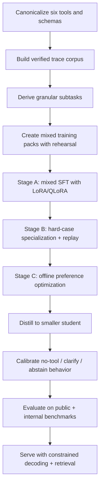

# Specializing an Open-Source LLM for Six Tools Without External APIs

## Executive summary

The strongest current pattern is not “just fine-tune on tool traces.” The best results come from combining four ideas: highly verifiable tool-use data, granular supervision that decomposes tool use into subtasks, retention-aware post-training to preserve general language ability, and an execution-aware final alignment stage. Recent work such as urlAPIGenturn13search1, urlToolACEturn3search10, urlToolLLMturn6search1, urlTRICEturn10search0, urlSTEturn35search0, and the granular multi-task approach behind urlGranite-20B-FunctionCallingturn18search1 all point in the same direction: data quality and decomposition matter as much as, and often more than, the choice of alignment algorithm. citeturn13search1turn3search10turn6search1turn10search0turn35search0turn19view4

For your setting, the best practical default is to start with a strong 7B–8B open-weight base, train it with mixed general-plus-tool supervision using LoRA or QLoRA, keep rehearsal data in every stage, and only then distill to a 3B–4B student. If you need a final edge model smaller than that, distill again into a specialized 1B–2B student; do not jump directly from a generic base to a tiny final model unless you accept a substantial robustness hit. Current small function-calling models show that this is feasible, but public evidence also shows that realistic multi-turn and “wild” tool use remains hard even for strong models. citeturn19view2turn29search2turn29search3turn21view0turn21view1

I would therefore recommend this concrete plan: use either urlQwen3-8B model cardturn15search1 or urlGranite-4.1-8B model cardturn18search0 as the main teacher or production base; train with a corpus that mixes tool traces with retained general instruction data; add a local retriever over tool docs, examples, and changelogs rather than hard-coding everything into weights; use DPO, SimPO, or ORPO on offline preference pairs before attempting PPO or GRPO; and evaluate with both executable tool metrics and general-language retention metrics. This recommendation is driven by the model cards for these bases, by PEFT results from LoRA and QLoRA, by the simplicity advantages of DPO-like methods, and by benchmark evidence showing that function-calling accuracy alone is not enough. citeturn17view5turn19view1turn4search1turn4search2turn32view3turn34search2turn34search3turn21view0turn23search0turn21view2

## What the current literature actually says

The field has moved from “prompt the model with tool docs” to “post-train on large, verified interaction corpora and score success by execution.” Early prompting work such as urlTool Documentation Enables Zero-Shot Tool Usageturn22search0 and urlReActturn27search0 showed that tool documentation and interleaved reasoning/action already unlock substantial capability without training. Later work shifted the center of gravity toward large-scale data generation and execution verification: urlToolAlpacaturn13search2 used simulated multi-agent generation; urlToolLLMturn6search1 scaled to very large API inventories with a neural retriever; urlAPIGenturn13search1 emphasized format checking, real execution, and semantic verification; and urlToolACEturn3search10 emphasized self-evolving API synthesis, dialog generation, and dual-layer verification. citeturn22search0turn27search0turn13search2turn6search1turn13search1turn3search10

A second clear trend is that smaller models can become surprisingly strong function callers if the post-training recipe is specialized. Public releases such as urlxLAM-1b-fc-rturn18search3, urlTinyAgentturn29search2, urlHammerturn29search3, urlToolACE-8Bturn18search2, and urlGranite-20B-FunctionCallingturn18search1 all embody this. The key lesson is not that tiny models replace stronger general bases, but that strong local teachers plus specialized post-training can move surprisingly far down the size curve. citeturn19view2turn29search2turn29search3turn18search2turn19view4

A third trend is that public tool-use benchmarks are now mature enough to show the gap between benchmark saturation and real-world reliability. urlBFCL V4 leaderboardturn20search1 has expanded from pure function-calling toward holistic agentic evaluation. urlToolSandboxturn12search3 and urlMINTturn13search3 stress stateful and multi-turn interaction. urlWhen2Callturn23search2 and urlMetaToolturn23search1 focus on deciding whether to call a tool at all. urlWildToolBenchturn21view0 is the sharpest warning sign: it reports that no tested model exceeds 15% session accuracy in realistic, noisy, multi-turn settings. citeturn21view1turn12search3turn13search3turn23search0turn23search1turn21view0

The implication for your six-tool system is important. Because your tool inventory is fixed and small, you do not need the full machinery designed for tens of thousands of APIs unless your tools are highly dynamic. Large-action-space methods such as ToolLLM, ToolChain*, COLT, ToolkenGPT, and ToolGen are most valuable when the action space is large, ambiguous, or constantly changing. For six stable tools, their main value is conceptual: schema normalization, retrieval over examples and docs, and structured routing. The expensive parts of these methods are optional in your case. This is an engineering inference from the literature, not a direct claim from any single paper. citeturn6search1turn12search2turn24search0turn12search0turn26search0

## Recommended training pipeline

The pipeline below combines APIGen-style verification, ToolACE-style synthesis, Granite-style granular multi-tasking, retention-aware rehearsal, and an offline preference stage. That combination matches the strongest high-confidence evidence in the literature for a practical six-tool specialization pipeline. citeturn13search1turn3search10turn13search12turn7search0turn7search2turn32view3turn34search2turn34search3

### Data preparation

First, define one canonical tool schema for all six tools and freeze it for one training cycle. Rewrite long or messy docs into short, model-facing tool cards with: purpose, required arguments, default assumptions, failure conditions, one minimal positive example, one clarification example, and one no-tool example. This is directly motivated by work showing that tool documentation can match or beat demonstrations in zero-shot settings, that concise tool instructions reduce prompt bloat, and that iteratively refined documentation improves tool use. citeturn22search0turn12search1turn22search2turn11view0

Second, convert each raw interaction into a verified trajectory. Use a three-layer filter very similar to APIGen: schema conformity, actual execution, and semantic correctness of the resulting answer. If you can run the six tools locally or in a local simulator, you should reject any trace that fails execution and keep detailed error labels. ToolACE’s dual-layer verification and APIGen’s executable filtering are exactly the right template here. citeturn13search1turn13search5turn13search4

Third, decompose each verified trajectory into granular supervision. Do not only train on end-to-end “user → tool call.” Also derive: tool-needed vs no-tool classification, clarification-needed classification, next-best-tool selection, argument extraction, argument normalization, sequential planning, parallel planning, final answer generation, and post-tool response grounding. The best evidence for this comes from the Granite function-calling work, which explicitly trains on granular function-calling subtasks rather than only end-to-end calls. citeturn19view4turn13search12

Fourth, create negative data aggressively. Include irrelevant-tool distractors, underspecified requests that should trigger clarification, tasks answerable without tools, tasks impossible with the given six tools, argument collisions, contradictory user edits across turns, and paraphrase variants that preserve intent. This is important because robustness work and the newer decision benchmarks show that current models often fail not on emitting a call, but on knowing when not to call, when to ask, and how to stay stable under prompt or toolkit perturbations. citeturn23search0turn23search3turn21view2

### Retention-aware corpus design

Catastrophic forgetting is real in continual or domain-specific fine-tuning, and for 1B–7B models it can be severe. A reliable mitigation is to keep a rehearsal mixture at every stage, ideally with both real retained general data and synthetic replay when needed. General instruction tuning before specialization also helps reduce later forgetting. citeturn7search0turn7search2turn4search3

For a practical mixture schedule, I recommend this starting point:

| Stage | Goal | Data mix |
|---|---|---|
| Warm start | preserve chat/instruction prior while introducing tool syntax | 70% general retention, 30% tool data |
| Specialization | improve routing, arguments, multi-turn control | 50% general retention, 50% tool data |
| Hard-case phase | improve edge cases without collapse | 30% general retention, 70% hard tool data |
| Preference stage | choose better behaviors among valid alternatives | pairwise preference data plus a small general replay buffer |

This schedule is an engineering recommendation derived from the forgetting literature, rehearsal papers, and practical post-training studies rather than a single canonical paper default. citeturn7search0turn7search2turn32view0

### Stage A instruction tuning

Use mixed supervised fine-tuning first. For most teams, this should be LoRA or QLoRA rather than full-model fine-tuning. Full fine-tuning still has the highest quality ceiling, but it is materially more expensive, less modular, and more prone to forgetting unless you are very disciplined about data mixing and validation. LoRA reduces trainable parameters by orders of magnitude, and QLoRA makes larger models feasible on modest hardware while retaining much of full fine-tuning quality. citeturn4search2turn4search1turn32view0

Recommended starting hyperparameters for Stage A:

| Setting | 7B–8B base | 3B–4B base | Notes |
|---|---:|---:|---|
| Adapter | LoRA or QLoRA | LoRA or QLoRA | Best default for specialization |
| Target modules | q,k,v,o + gate, up, down proj | same | Strong default for modern decoder LLMs |
| LoRA rank `r` | 64 | 32–64 | Start lower if data is small |
| LoRA alpha | 128 | 64–128 | Start at `2r` |
| LoRA dropout | 0.05 | 0.05 | Set 0 for very large clean corpora |
| LR | 1e-4 to 2e-4 | 1e-4 to 3e-4 | Prefer lower end for noisier data |
| Optimizer | AdamW | AdamW | Betas around 0.9 / 0.95 are a solid start |
| Warmup | 3% to 5% | 3% to 5% | Cosine or linear both work |
| Sequence length | 2k to 8k | 2k to 8k | Match your task distribution |
| Epochs | 1 to 3 | 1 to 3 | Use early stopping, not blind epoch counts |

These are recommended starting grids rather than universal optima. They are consistent with LoRA, QLoRA, and more recent fine-tuning optimization studies. Enable gradient checkpointing and FlashAttention-style kernels on supported hardware; use ZeRO/FSDP only if you truly need them, because for 7B–8B adapter tuning the simplest stack is usually the most stable. citeturn4search2turn4search1turn32view0

### Stage B tool grounding and schema control

For six tools, I would not start with a heavy modular tool-token architecture. First make standard fine-tuning work. Then add one of the following, in order of practicality:

1. **Constrained decoding plus schema validation.** Force valid JSON or function-call syntax and reject out-of-schema arguments.
2. **Function masking.** Borrow Hammer’s idea: explicitly mask irrelevant tool names during the selection step or train with negatives that sharpen relevance detection.
3. **Retriever over docs, examples, and changelogs.** Keep this small and local; examples are often more valuable than prose.
4. **Tool-token or tool-embedding methods.** Only add these if the six-tool set will later expand or change frequently.

The underlying evidence is strong: Hammer improves robustness with function masking, tool-documentation work shows structured tool cards matter, DRAFT and EasyTool show better docs improve behavior, and API-doc RAG work found that code examples often contribute more than descriptive text. citeturn29search3turn22search0turn12search1turn22search2turn6search7

### Retrieval augmentation

With only six tools, retrieval is not for tool inventory scale; it is for dynamic non-parametric grounding. Put the following in a retrievable local store: rewritten schema cards, worked examples, argument edge cases, version diffs, known error messages, and a small FAQ explaining when not to use each tool. Use a simple first-stage retriever and, if needed, a lightweight reranker. The literature on COLT and tool retrieval is useful here mostly as a reminder that retrieval should optimize completeness and diversity, not just semantic similarity. citeturn24search0turn22search0turn12search1turn11view0

If you later grow from six tools to dozens or more, revisit ToolLLM-style retrievers, ToolGen-style generated tool tokens, or ToolkenGPT-style tool embeddings. At six tools, those are usually over-engineered. That is my inference from papers that were designed explicitly for large and growing toolspaces. citeturn6search1turn12search0turn26search0

### Stage C offline preference optimization and RL

If you already have a large offline dataset of tool interactions, use an offline preference stage before any online RL. DPO’s main practical advantage is that it avoids explicit reward-model-plus-PPO complexity. ORPO and SimPO are even more attractive when memory is tight because they remove the reference model or simplify the reward parameterization. KTO can be useful if your supervision is binary “desirable / undesirable” rather than pairwise. citeturn32view3turn34search2turn34search3turn34search0

My recommendation is:

- **Default:** DPO or SimPO on pairwise preferences derived from execution outcomes.
- **Memory-constrained default:** ORPO or SimPO.
- **Only use PPO/GRPO if:** you have a deterministic local environment, cheap rollouts, reliable executable rewards, and engineering tolerance for instability.

Recent tool-use RL papers show real gains, especially when rewards are execution-based and multi-step, but they also confirm that reward design and rollout infrastructure are the hard part. ToolRL focuses explicitly on reward design; ReTool, Tool-Star, EGPO, and Tool-R1 show that online RL can materially improve tool use, but the total system complexity is much higher than for DPO-like methods. citeturn9search0turn9search1turn10search3turn8search2turn8search1turn33search0

For offline pair construction, label one completion as “chosen” if it executes, matches required semantics, and uses the minimal correct behavior; label “rejected” variants from wrong tool selection, invalid arguments, unnecessary tool use, missing clarification, or bad final grounding. This gives you preferences that teach not only syntax but policy. Pairwise optimization is especially useful for “call vs do not call,” “call now vs ask for clarification,” and “choose tool A vs tool B.” citeturn23search0turn23search1turn21view2turn32view3turn34search2turn34search3

### Distillation to a smaller model

To move down in size, distill from the best 7B–8B policy into a 3B–4B student using a mixture of response distillation, trace distillation, and preference distillation. Rationales can help smaller models, but long open-ended chain-of-thought is not obviously beneficial for function-calling. Distillation work shows that stepwise rationale supervision can substantially improve smaller models, while emerging function-calling evidence suggests that long free-form reasoning can hurt tool routing and hallucinate functions. In practice, distill brief structured scratchpads such as “tool: X / key args: … / ask: …” rather than long free-form CoT. citeturn5search2turn5search5turn20search12turn27search0

A good default cascade is:

- teacher: 7B–8B general base specialized for your six tools,
- student: 3B–4B main deployment model,
- optional edge student: 1B–2B only if required by memory or offline-device constraints.

This is consistent with the public trajectories of xLAM, TinyAgent, Hammer, and the Granite function-calling releases. citeturn19view2turn29search2turn29search3turn19view4

## Model and method choices

### Recommended candidate bases

| Model | Size | Useful traits for this project | My recommendation |
|---|---:|---|---|
| Qwen3-8B | 8.2B | strong reasoning/instruction/agent orientation, 32k native with longer-context support | Best all-around starting base |
| Granite-4.1-8B | 8B | explicit tool-calling support, long-context instruct model, Apache-2.0 | Best if you want built-in FC priors |
| Qwen3-4B | 4.0B | same family, smaller deployment target | Best first student |
| Granite-4.1-3B | 3B | explicit tool-calling support at smaller size | Best compact student if Granite stack works for you |
| Qwen2.5-7B-Instruct | 7.6B | strong structured output and JSON behavior, 128k context | Very strong fallback base |
| Llama 3.1 8B Instruct | 8B | strong general-language baseline and large ecosystem | Good if you already standardized on it |
| Mistral-7B-Instruct-v0.3 | 7B | explicit function-calling support, lightweight and mature | Good pragmatic alternative |

Model size, context behavior, and function-calling support are taken from official model cards. citeturn17view5turn19view1turn17view4turn19view0turn16view6turn16view5turn16view3

If you want a strictly practical ranking rather than a broad survey, my order would be: **Qwen3-8B**, **Granite-4.1-8B**, **Qwen3-4B**, **Granite-4.1-3B**, then Qwen2.5-7B or Mistral-7B-v0.3. I would use Llama 3.1 8B mainly if you already have that ecosystem in place. Gemma 3 4B and SmolLM2 1.7B are interesting alternatives, especially for constrained environments, but I would not choose them first for a six-tool production specialization unless you have a strong reason to align with those ecosystems. citeturn16view4turn16view7turn17view5turn19view1turn17view4turn19view0turn16view6turn16view3

### Specialized teachers and baselines worth using

For teacher generation, ablations, or sanity checks, I would keep these nearby: urlToolACE-8Bturn18search2, urlxLAM-1b-fc-rturn18search3, urlTinyAgentturn29search2, urlHammerturn29search3, and urlGranite-20B-FunctionCallingturn18search1. They are useful not because you must deploy them, but because they encode different design bets: data-centric synthesis, tiny-device specialization, function masking, and granular multi-task post-training. citeturn18search2turn19view2turn29search2turn29search3turn19view4

### Method comparison

| Method | Quality ceiling | Compute cost | Forgetting risk | Best use | Main drawback |
|---|---|---|---|---|---|
| Prompting + tool docs only | low to medium | very low | none | bootstrapping, cold-start, zero-training pilots | fragile, poor consistency |
| Full-model fine-tuning | highest | very high | highest | final squeeze when compute is abundant | expensive, least modular |
| LoRA / QLoRA | high | low to medium | medium | default for most teams | slightly lower ceiling than the best full FT |
| Adapters / prefix / LLaMA-Adapter style | medium | low | medium | modular specialization with frozen base | may underperform on hard FC edge cases |
| Tool-token / tool-embedding modules | medium to high in large inventories | medium to high | medium | growing or very large tool libraries | bespoke pipeline; overkill for 6 tools |
| DPO / SimPO / ORPO / KTO | high | medium | medium | offline behavior shaping from pairwise/binary labels | depends on preference data quality |
| PPO / GRPO and related RL | potentially highest on executable tasks | highest system cost | medium to high | only when you have cheap, reliable rollouts | reward design and training instability |

This comparison is synthesized from LoRA, QLoRA, LLaMA-Adapter, ToolkenGPT, ToolGen, DPO, ORPO, SimPO, KTO, and recent tool-use RL papers. citeturn4search2turn4search1turn5search0turn12search0turn26search0turn32view3turn34search2turn34search3turn34search0turn9search0turn9search1turn8search1

My bottom-line recommendation is straightforward: **LoRA or QLoRA + rehearsal + offline preference optimization** should be your default recipe. Only move to full fine-tuning if you have already proven that your data and evaluation are clean and your remaining gap is clearly due to adapter capacity. Only move to PPO or GRPO if DPO-like methods stop improving and your local environment can supply cheap and reliable rewards. citeturn4search1turn4search2turn32view3turn34search2turn34search3turn9search0turn8search2

## Evaluation, validation, and experiments

### What to measure

| Layer | Metric | Why it matters | Public benchmarks |
|---|---|---|---|
| Tool decision | tool-needed / no-tool / clarify accuracy | prevents useless or dangerous calls | When2Call, MetaTool |
| Tool routing | top-1 tool accuracy, irrelevant-tool rejection | catches wrong-tool errors early | BFCL, API-Bank |
| Arguments | exact match on normalized args, typed slot F1, executable-call rate | most production failures are argument failures | BFCL, API-Bank |
| Workflow | multi-step success, session success, state correctness | single-step scores overestimate real quality | BFCL V3/V4, ToolSandbox, MINT |
| Realism | wild-session accuracy, robustness to prompt/toolkit perturbation | catches brittle policies | WildToolBench, robustness benchmark |
| General retention | delta versus the untuned base on a frozen general suite | tracks catastrophic forgetting | internal general suite plus standard public sets |

The benchmark choices are grounded in the public benchmark landscape: BFCL now covers broader agentic evaluation, ToolSandbox and MINT emphasize stateful and multi-turn interaction, When2Call and MetaTool cover decision quality, and WildToolBench plus robustness work show how quickly performance can collapse in more realistic settings. citeturn21view1turn12search3turn13search3turn23search0turn23search1turn21view0turn21view2

### Validation strategy

Use four validation slices, not one:

- **In-distribution tool traces** for early loss and syntax sanity.
- **Compositional holdout** with unseen tool combinations and multi-turn edits.
- **Decision holdout** with no-tool, clarify, and impossible-tool cases.
- **General retention holdout** sampled from broad instruction, reasoning, writing, and coding tasks.

Checkpoint selection should be Pareto-based, not single-metric. Keep a model only if it improves tool metrics while staying within a small tolerated retention drop relative to the base. In practice, I would freeze a maximum allowed drop on the general suite before the run starts. This recommendation follows directly from the forgetting literature and from the fact that public tool benchmarks do not fully capture general-language regression. citeturn7search0turn7search2turn21view0turn21view2

### Suggested ablations

The minimum serious ablation matrix is:

1. prompt-only vs mixed SFT,
2. full FT vs LoRA vs QLoRA,
3. end-to-end-only supervision vs granular multi-task supervision,
4. no replay vs replay vs synthetic replay,
5. no retrieval vs doc retrieval vs doc-plus-example retrieval,
6. SFT-only vs SFT+DPO vs SFT+ORPO or SimPO,
7. unconstrained decoding vs constrained JSON/function decoding,
8. long free-form reasoning vs brief structured scratchpad.

This matrix maps directly to major fault lines in the literature: verification, decomposition, retention, retrieval, preference optimization, and reasoning format. citeturn13search1turn3search10turn19view4turn7search2turn6search7turn32view3turn34search2turn34search3turn20search12

### Visualization suggestions

The most informative visuals for this project are:

- a **Pareto chart** of tool success versus general retention across checkpoints,
- a **forgetting curve** over training steps for the general holdout,
- a **stacked error taxonomy** showing wrong tool, bad arguments, unnecessary tool use, missed clarification, invalid JSON, and bad post-tool answer grounding,
- a **session Sankey** for multi-turn failure propagation,
- a **calibration reliability plot** for “call / no-call / clarify” probabilities,
- and the **mermaid training pipeline** above.

These are not claims from a specific paper; they are the most decision-useful reporting views implied by the newer benchmark and robustness literature. citeturn21view1turn12search3turn13search3turn23search0turn21view0turn21view2

## Deployment, operations, and open questions

For training and serving, the most practical open stack today is urlPEFTturn30search0 plus urlTRLturn30search1 for post-training, then urlvLLMturn30search2 or urlSGLangturn30search3 for high-throughput serving, with urlllama.cppturn31search0 available when you need very small-footprint offline inference. TRL now also exposes environment-facing integrations useful if you later decide to do local rollout-based RL with a tool environment. citeturn30search0turn30search1turn30search2turn30search3turn33search1turn33search2turn31search0

At inference time, keep the policy narrow and deterministic. That means: concise tool cards retrieved on demand, constrained decoding into your canonical function-call schema, one automatic repair attempt on invalid calls, schema/type validation before execution, and explicit support for three non-execution policies: direct answer, clarification question, and abstention. That policy split is strongly supported by the decision benchmarks and robustness work. citeturn23search0turn23search1turn21view2

If you want to avoid dependence on proprietary APIs even for synthetic data generation, the literature now gives you a credible path. DRAFT, STE, TRICE, and newer self-simulation approaches show that execution feedback and self-driven interaction can improve tool use without a proprietary teacher, and early 2026 work such as TRUSTEE argues that fully open simulated environments are now viable for cost-friendly tool-agent training. I would treat that last claim as promising but still early, not yet as conservative production doctrine. citeturn22search2turn35search0turn35search1turn35search14

The main limitation in the public literature is that benchmark gains still do not guarantee robust real-world behavior. WildToolBench shows a large reality gap, the robustness benchmark shows sensitivity to query and toolkit perturbations, and newer work such as EigenData argues that outcome-aware evaluation correlates better with human judgments than trajectory matching alone. That is why your internal benchmark should score end-task correctness after execution, not only string similarity to a gold call. citeturn21view0turn21view2turn20search9

### Primary sources and official repos

Core data and benchmark references: urlAPIGenturn13search1, urlToolACEturn3search10, urlToolLLMturn6search1, urlBFCL V4 leaderboardturn20search1, urlToolSandboxturn12search3, urlMINTturn13search3, urlWhen2Callturn23search2, urlWildToolBenchturn21view0.

Core method references: urlLoRAturn4search2, urlQLoRAturn4search1, urlLLaMA-Adapterturn5search0, urlToolkenGPTturn12search0, urlToolGenturn26search0, urlDPOturn4search0, urlORPOturn8search3, urlSimPOturn9search3, urlKTOturn34search0, urlToolRLturn9search0, urlReToolturn9search1, urlTool-R1turn8search1.

Core model references: urlQwen3-8B model cardturn15search1, urlQwen3-4B model cardturn15search0, urlGranite-4.1-8B model cardturn18search0, urlGranite-4.1-3B model cardturn18search13, urlQwen2.5-7B-Instruct model cardturn14search0, urlLlama-3.1-8B-Instruct model cardturn14search1, urlMistral-7B-Instruct-v0.3 model cardturn15search3, urlxLAM-1b-fc-rturn18search3, urlToolACE-8Bturn18search2, urlTinyAgentturn29search2, urlHammerturn29search3.

### Open questions and limitations

Two questions are still genuinely open. First, how much explicit reasoning should a compact function-calling model emit before acting? Recent evidence suggests that brief structured scratchpads may outperform long free-form CoT in function-calling settings, but that conclusion is still new and should be validated on your own six-tool environment. Second, how far can fully open teacher-and-simulator stacks replace proprietary teachers at equal quality? Early 2026 results are encouraging, but public evidence is not yet as mature as for the data-centric and offline-preference parts of the pipeline. citeturn20search12turn35search14